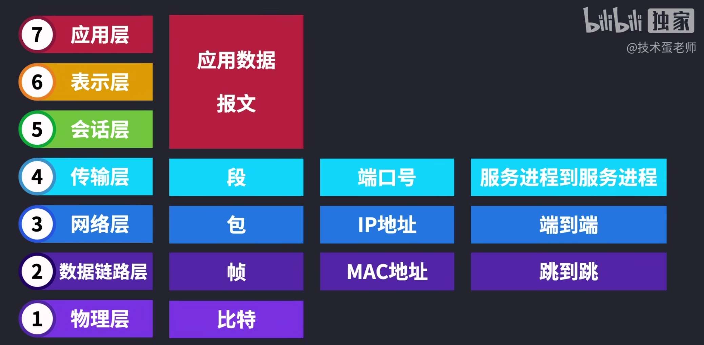
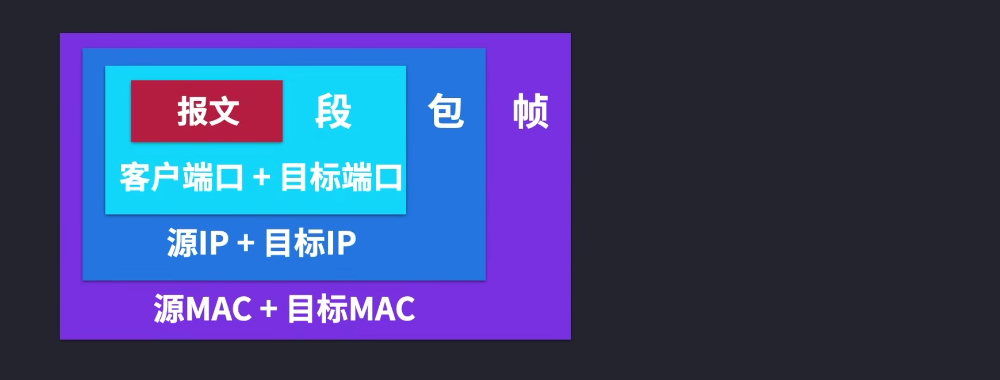
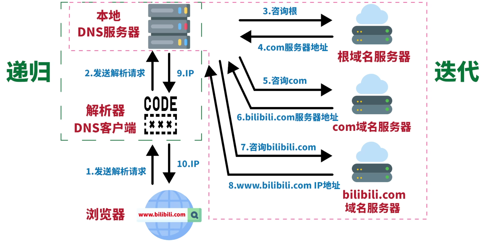

### 说说 JavaScript 中的数据类型
- 基本类型：number、boolean、string、undefined、 null、symbol
- 引用类型：array、object、function、regexp、set、map
- 简单类型是栈内存，值引用
- 引用类型是堆内存，地址引用
- 两种情况发生隐式转换的场景：算术运算、比较运算

### JS 数组去重的方式有哪些？
- Set + Array.form
- filter + indexOf、includes
- map
- https://blog.csdn.net/qq_52732369/article/details/121877897


### 什么是响应式设计？响应式设计的基本原理是什么？如何做？
- 页面的设计与开发应当根据用户行为以及设备环境(屏幕尺寸、屏幕定向等)进行相应的响应和调整
- 实现方式有媒体查询、vw/vh、百分比、rem
- 除此之外，我们还可以利用主流UI框架，如：element ui、antd提供的栅格布局实现响应式
- https://github.com/febobo/web-interview/issues/108


### Javascript 本地存储的方式有哪些
- Http无状态：服务器不会保留客户端交易的任何状态和数据，一旦数据交换完毕，客户端与服务器端的连接就会关闭
- Cookie：不超过 4KB小型文本文件，为了辨别用户身份而储存在用户本地终端上的数据，每次请求中都会被发送
- Cookie：它由一个名称、一个值和其它几个用于控制 cookie 有效期、安全性、使用范围的可选属性组成
- localStorage：H5新特性，持久化的本地存储，除非主动删除数据，否则数据是永远不会过期的
- localStorage：只能存入字符串，存对象需要JSON.stringify转换，存储的信息在同一域中是共享的
- sessionStorage：生命周期，一旦页面（会话）关闭，sessionStorage 将会删除数据
- sessionStorage和localStorage不会自动把数据发给服务器，仅在本地保存
- https://github.com/febobo/web-interview/issues/79


### 如何实现 jwt 鉴权机制？token 的作用是什么？
- JWT(JSON Web Token)本质就是一个字符串书写规范，作用是用来在用户和服务器之间传递安全可靠的信息
- 在目前前后端分离的开发过程中，使用 token 鉴权机制用于身份验证是最常见的方案
- Token 分成了三部分，头部（Header）、载荷（Payload）、签名（Signature）
- 服务器当验证用户账号和密码正确的时候，给用户颁发一个令牌，这个令牌作为后续用户访问一些接口的凭证
- 后续访问会根据这个令牌判断用户时候有权限进行访问
- 项目中使用第三方库jsonwebtoken来进行实践，并搭配本地存储实现缓存
- 优点：json具有通用性，所以可以跨语言、服务端无需保存会话信息、解决单点登录问题、可防护CSRF攻击
- 缺点：需要保护好加密密钥、为避免token被劫持，最好使用https协议

- 另一种身份认证方式：Session
```
sessionID 存储在服务器中，但是以 cookie 作为载体。把 sessionID 放入 cookie 中发送给客户端，客户端每次请求在以 cookie 作为载体发送 sessionID 过来，进行鉴权
```
- https://github.com/febobo/web-interview/issues/170


### 什么是 HTTP? HTTP 和 HTTPS 的区别?
- HTTP (HyperText Transfer Protocol)，即超文本运输协议，是实现网络通信的一种规范
- HTTP 常被用于在Web浏览器和网站服务器之间传递信息，以明文方式发送内容，不提供任何方式的数据加密
- HTTP 特点、HTTPS 定义、HTTPS 如何通信
- HTTPS 通过 SSL 证书来验证服务器的身份，并为浏览器和服务器之间的通信进行加密
- 浏览器和服务器在使用 SSL 建立连接时需要选择一组恰当的加密算法来实现安全通信，为数据通讯提供安全支持
- HTTP 和 HTTPS 使用连接方式不同，默认端口也不一样，HTTP是80，HTTPS是443
- HTTPS 由于需要设计加密以及多次握手，性能方面不如 HTTP
- https://github.com/febobo/web-interview/issues/134


### 如何理解 OSI 七层模型?
- 第一层：物理层，作用是实现计算机节点之间比特流的透明传送
- 第二层：数据链路层，这一层传输的数据叫做帧，通过 MAC 地址（物理地址）传输
- 第三层：网络层，主要任务就是选择合适的网间路由和交换节点（IP地址），使数据（包）成功传送到目标主机
- 第四层：传输层，主要任务是为主机中不同的软件进程进行数据（段）传输（通过端口号），协议是TCP和UDP
- 第五层：会话层，就是负责建立、管理和终止表示层实体之间的通信会话
- 第六层：表示层，作用是使通信的应用程序能够解释交换数据的含义
- 第七层：应用层，该层协议定义了应用进程之间的交互规则，通过不同的应用层协议为不同的网络应用提供服务
- 最后三层的数据都是应用数据，也称为报文，协议使用http和https
- https://github.com/febobo/web-interview/issues/139
- https://www.bilibili.com/video/BV1EU4y1v7ju/?spm_id_from=333.999.0.0


### 说说 HTTP 常见的状态码有哪些，适用场景？*
- http状态码的作用是服务器告诉客户端当前请求响应的状态，通过状态码就能判断和分析服务器的运行状态
- https://github.com/febobo/web-interview/issues/144


### 如何理解 TCP/IP 模型?
- TCP/IP，传输控制协议/网际协议，是指能够在多个不同网络间实现信息传输的协议族
- TCP/IP协议族按层次分别了五层体系或者四层体系
- 五层体系：综合了 OSI 和 TCP/IP 优点的一种协议，包括应用层、传输层、网络层、数据链路层和物理层
- 四层体系：包括应用层、传输层、网络层、网络接口层
- TCP/IP模型 与 OSI 七层模型相同点和不同点 
- https://github.com/febobo/web-interview/issues/140


### 如何理解 UDP 和 TCP? 区别? 应用场景?
- UDP：用户数据包协议，是一个简单的面向数据报的通信协议，不可靠协议
- UDP：无论应用层交给 UDP 多长的报文，它统统发送，一次发送一个报文
- TCP：传输控制协议，是一种可靠、面向字节流的通信协议，把上面应用层交下来的数据看成无结构的字节流来发送
- TCP 是面向连接的协议，建立连接3次握手、断开连接四次挥手，UDP是面向无连接
- TCP 提供可靠的服务，传输过程确保数据无差错，不丢失。UDP 则尽可能传递数据，但不保证传递交付给对方
- TCP 面向字节流，将应用层报文看成一串无结构的字节流。UDP协议面向报文，不拆分应用层报文
- TCP 只能点对点全双工通信。UDP 支持一对一、一对多、多对一和多对多的交互通信
- https://github.com/febobo/web-interview/issues/136


### 说说 TCP 为什么需要三次握手和四次挥手？
- 三次握手（Three-way Handshake）其实就是指建立一个TCP连接时，需要客户端和服务器总共发送3个包
- 主要作用就是为了确认双方的接收能力和发送能力是否正常
- 客户端发包（SYN），服务端收到。服务端确认：客户端的发送能力是正常的
- 服务端发包（SYN + ACK），客户端收到。客户端确认：服务端的接收能力是正常的
- 客户端发包（ACK），服务端收到。服务端确认：客户端即将给我发送数据，我要准备接收

- tcp 终止一个连接，需要经过四次挥手
- 客户端发包，服务端接收。服务端确认：客户端已经请求结束
- 服务端发包，客户端接收。客户端确认：服务端已经收到，我等待它关闭
- 服务端发包：客户端接受。客户端确认：服务端已经发送完成，可以关闭
- 客户端发包，服务端接收。服务端确认：可以关闭了
- https://github.com/febobo/web-interview/issues/151


### 说说对 WebSocket 的理解？应用场景？
- 一种网络传输协议，位于OSI模型的应用层，应用场景有：协同编辑、媒体聊天、弹幕等
- 可在单个TCP连接上进行全双工通信，能更好的节省服务器资源和带宽并达到实时通迅
- 客户端和服务器只需要完成一次握手，两者之间就可以创建持久性的连接，并进行双向数据传输
- 项目中一般可通过使用第三方库 Socket.io 来实现业务
- http 协议的即时通讯通过轮询实现
- https://github.com/febobo/web-interview/issues/152
- https://juejin.cn/post/6908327746473033741#heading-89


### DNS协议 是什么？说说DNS 完整的查询过程?
- DNS 域名系统，是互联网一项服务，是进行域名和与之相对应的 IP 地址进行转换的服务器
- 域名是一个具有层次的结构，从上到下依次为根域名、顶级域名、二级域名、三级域名...
- 在域名的每一层都会有一个域名服务器：根、顶级、权限域名服务器
- 解析域名的过程如下：
```
首先搜索浏览器的 DNS 缓存，缓存中维护一张域名与 IP 地址的对应表
若没有命中，则继续搜索操作系统的 DNS 缓存
若仍然没有命中，则操作系统将域名发送至本地域名服务器，
本地域名服务器采用递归查询自己的 DNS 缓存，查找成功则返回结果

若本地域名服务器的 DNS 缓存没有命中，则本地域名服务器向上级域名服务器进行迭代查询
    首先本地域名服务器向根域名服务器发起请求，根域名服务器返回顶级域名服务器的地址给本地服务器
    本地域名服务器拿到这个顶级域名服务器的地址后，就向其发起请求，获取权限域名服务器的地址
    本地域名服务器根据权限域名服务器的地址向其发起请求，最终得到该域名对应的 IP 地址

本地域名服务器将得到的 IP 地址返回给操作系统，同时自己将 IP 地址缓存起来
操作系统将 IP 地址返回给浏览器，同时自己也将 IP 地址缓存起
至此，浏览器就得到了域名对应的 IP 地址，并将 IP 地址缓存起
```
- https://github.com/febobo/web-interview/issues/141
- https://www.bilibili.com/video/BV1uL4y1B7aE/?spm_id_from=333.999.0.0


### 参考图片






