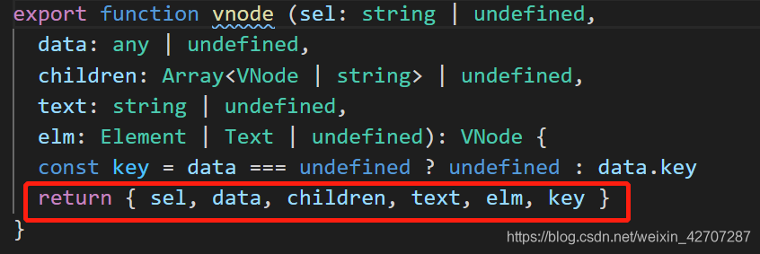
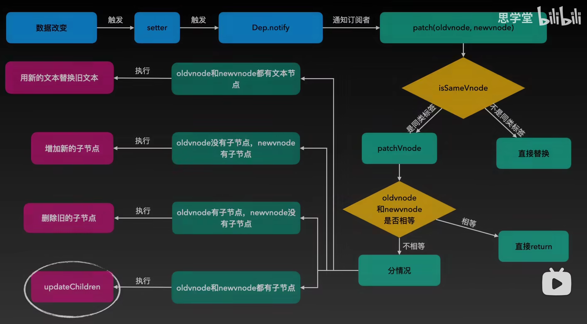
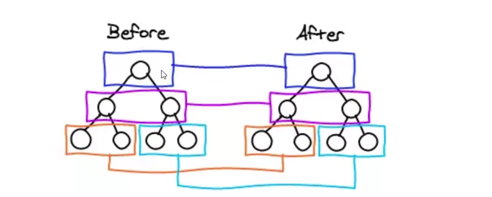
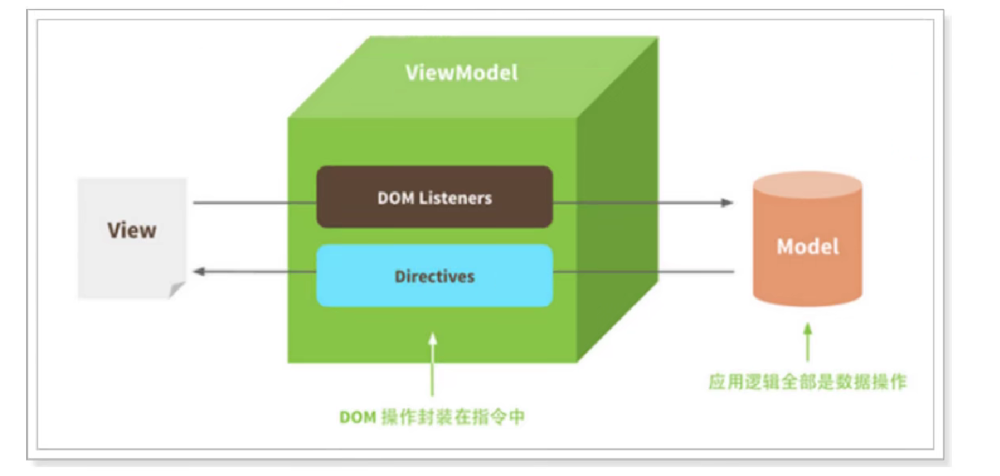

### 说说 Webpack 中 Loader 和 Plugin 的区别？
- loader 是文件加载器，能够加载资源文件，并对这些文件进行一些处理，诸如编译、压缩等，最终一起打包到指定的文件中

- plugin 赋予了webpack各种灵活的功能，如打包优化、资源管理、环境变量注入等，目的是解决loader无法实现的其他事

- loader 运行在打包文件之前，而 plugins 在整个编译周期都起作用

- https://github.com/febobo/web-interview/issues/125


### 你知道哪些vue3新特性?
- 通过官方文档我们可以得到

- API 方面：
Suspense、自定义渲染器、Emits选项、Fragments片段、Teleport传送门、Setup 语法糖、Composition API

- 性能优化方面：
更支持TypeScript + 模块化、更好的摇树优化、基于Proxy的响应式系统、编译器优化、虚拟DOM重写、diff算法优化等

- https://juejin.cn/post/7097067108663558151#heading-52


### Vue组件之间通信方式有哪些？
- 通过组件实例访问：`$ref、$root、$children（vue3已废除）、$parent`

- 通过这些API：`$attrs、$listeners（vue3已废除）、$emits、$props、provide、inject`

- 通过全局事件总线 eventbus（vue3已废除），用 mitt 替代

- 通过全局状态管理 vuex、pinia

- 或者也可以使用插槽 slot 进行通信

- https://v3-migration.vuejs.org/zh/breaking-changes/children.html
- https://v3-migration.vuejs.org/zh/breaking-changes/listeners-removed.html


### v-if 和 v-for 哪个优先级更高？
- 实践中不应该把v-for和v-if放一起
- 在vue2中，v-for的优先级是高于v-if，把它们放在一起，输出的渲染函数中可以看出会先执行循环再判断条件，哪怕我们只渲染列表中一小部分元素，也得在每次重渲染的时候遍历整个列表，这会比较浪费
- 在vue3中则完全相反，v-if的优先级高于v-for，所以v-if执行时，它调用的变量还不存在，就会导致异常
- 为了过滤列表中的项目：可以使用 computed 先对列表过滤
- 为了避免渲染本应该被隐藏的列表：可以 v-if 移动至子容器元素上或者外面包一层template即可
- https://juejin.cn/post/7097067108663558151#heading-6


### 简述 Vue 的生命周期以及每个阶段做的事
- beforeCreate：组件实例被创建之前，通常用于插件开发中执行一些初始化任务

- created：组件实例已经完全创建，组件初始化完毕，可以访问各种数据，获取接口数据等

- beforeMount：组件挂载之前

- mounted：组件挂载到实例上去之后，可用于获取访问数据和dom元素，访问子组件等

- beforeUpdate：此时view层还未更新，可用于获取更新前各种状态

- updated：完成view层的更新，更新后，所有状态已是最新

- beforeDestroy/beforeunmount：实例被销毁前调用，可用于一些定时器或订阅的取消

- destroyed/unmounted：销毁一个实例。可清理它与其它实例的连接，解绑它的全部指令及事件监听器

- setup 已经将 created、beforeCreate 合并

- activated：keep-alive 缓存的组件激活时，deactivated：keep-alive 缓存的组件停用时调用


### 能说一说 Vue 中双向绑定的使用和原理吗？
- vue中双向绑定是一个指令v-model，可以绑定一个响应式数据到视图，同时视图中变化能改变该值

- 通常在表单项上使用v-model，编译器根据表单元素的不同会展开不同的DOM属性和事件对

- 还可以在自定义组件上使用，实现 props 参数的可读可写，具体使用看文档或者演示

- https://juejin.cn/post/7097067108663558151#heading-16


### 说一说你对 Vue 响应式的理解？什么是 MVVM？
- 所谓数据响应式就是能够使数据变化可以被检测并对这种变化做出响应的机制

- 然后说MVVM框架：
```
MVVM 分为 Model（数据模型）、View（UI视图）、ViewModel

ViewModel负责实现一套数据响应式机制自动响应model中的数据变化，同时实现一套更新策略自动将数据转化为视图更新

这种模式实现了 Model和View的数据自动同步，因此开发者只需要专注于数据的维护操作即可，而不需要自己操作DOM
```

- 最后说出 Vue2 响应式，Vue3 响应式
```
vue2中的数据响应式会根据数据类型来做不同处理，如果是对象则采用Object.defineProperty()的方式定义数据拦截，当数据被访问或发生变化时，我们感知并作出响应；如果是数组则通过覆盖数组对象原型的7个变更方法。缺点：检测不到对象属性的添加和删除，需要对每个属性进行遍历监听，如果嵌套对象，需要深层监听，造成性能问题

vue3利用ES6的Proxy代理要响应化的数据，它有很多好处，编程体验是一致的，不需要使用特殊api，初始化性能和内存消耗都得到了大幅改善
```

- https://juejin.cn/post/7097067108663558151#heading-37
- https://juejin.cn/post/6919373017218809864#heading-5
- https://www.bilibili.com/video/BV137411N7aB/?spm_id_from=333.999.0.0


### Vue3.0里为什么要用 Proxy API 替代 defineProperty API？
- https://github.com/febobo/web-interview/issues/47
- https://github.com/febobo/web-interview/issues/42


### 说说你对虚拟 DOM 的理解？
- 虚拟dom（vdom），它只是一层对真实DOM的抽象，本身是一个 JS 对象，用对象的属性来描述dom节点

- 引入vdom的好处：将真实元素节点抽象成 VNode，有效减少直接操作 dom 次数，从而提高程序性能并且方便实现跨平台

- 什么时候会生成vdom？
```
在vue中我们常常会为组件编写模板 - template， 这个模板会被编译器 - compiler编译为渲染函数，在接下来的挂载 - mount 过程中会调用render函数，返回的对象就是虚拟dom。但它们还不是真正的dom，所以会在后续的patch过程中进一步转化为dom。

挂载过程结束后，vue程序进入更新流程。如果某些响应式数据发生变化，将会引起组件重新执行render函数，此时就会生成新的vdom，和上一次的渲染结果diff就能得到变化的地方，从而转换为最小量的dom操作，高效更新视图。
```

- https://juejin.cn/post/7097067108663558151#heading-42
- https://github.com/febobo/web-interview/issues/23


### 你了解diff算法吗？说说它的原理
- diff算法就是用于比较新旧两个虚拟dom之间差异的一种算法

- diff执行的时刻是
```
组件内响应式数据变更执行其更新函数时，更新函数会执行render函数获得最新的虚拟DOM，然后执行patch函数，并传入新旧两次虚拟DOM，通过比对两者找到变化的地方，最后将其转化为对应的DOM操作
```

- diff就是一个循环递归的过程：
patch —> patchVnode（更新节点） —> updateChildren（更新子节点） —> patchVnode —> updateChildren...

- diff原理：diff算法遵循 深度优先、同层比较（比较采用首位指针法）的策略
```
1、首先执行 patch 函数，传入两个Vnode，即新旧vdom的根节点。
通过sameVnode函数判断两个根节点是否相同，主要判断两者的key和元素类型等，所以这个时候key就比较关键
相同则调用 patchVnode 函数来更新两个节点，不相同则直接替换

2、patchVnode 函数更新节点的执行过程（会进行dom操作）：
2.1 如果新节点有文本节点text：
用新文本替代旧文本，如果旧文本有子节点则删除

2.2 如果新节点没有文本节点text，分为三种情况：
旧节点没有子节点，新节点有：增加新的子节点
旧节点有子节点，新节点没有：删除旧的子节点
旧节点有子节点，新节点也有：继续执行updateChildren函数

3、updateChildren函数中使用 首位指针法 继续比较各个子节点，子节点判断是否相同也是用sameVnode函数

对比过程中会引入四个指针，分别指向oldVnode子节点列表中的第一个节点和最后一个节点（后面我们简称为旧前和旧后）以及指向newVnode子节点列表中的第一个节点和最后一个节点（后面我们简称为新前和新后）
对比时，每一次对比按照以下顺序进行命中查找

旧前与新前节点对比（1）
旧后与新后节点对比（2）
旧前与新后节点对比（3）
旧后与新前节点对比（4）

上述四种情况，如果某一种情况两个指针对应的虚拟Dom相同，那么我们称之为命中，并继续执行patchVnode更新该子节点，命中之后指针会移动，之后开始下一次对比

如果都没有命中，则去oldVnode子节点列表循环查找当前新前指针所指向的节点，如果查到了，那么操作真实Dom移动节点，没查到则新增真实Dom节点插入

这种模式的对比会一直进行，直到满足了终止条件。即旧前指针移动到了旧后指针的后面或者新前指针移动到了新后指针的后面，我们可以理解为旧子节点先处理完毕和新子节点处理完毕。那么我们可以预想到新旧子节点中总会有其一先处理完，对比结束后，我们会根据没有处理完子节点的那一对前后指针决定是要插入真实Dom还是删除真实Dom。

如果旧子节点先处理完了，新子节点有剩余，说明有要新增的节点。将根据最终新前和新后之间的虚拟节点执行插入操作
如果新子节点先处理完了，旧子节点有剩余，说明有要删除的节点。将根据最终旧前和旧后之间的虚拟节点执行删除操作
```

- https://www.bilibili.com/video/BV1JR4y1R7Ln/?spm_id_from=333.337
- https://www.bilibili.com/video/BV1G7411N7Ef/?spm_id_from=333.999.0.0
- https://blog.csdn.net/m0_64023259/article/details/125476986
- https://blog.csdn.net/weixin_42707287/article/details/113994483


### 参考图片



