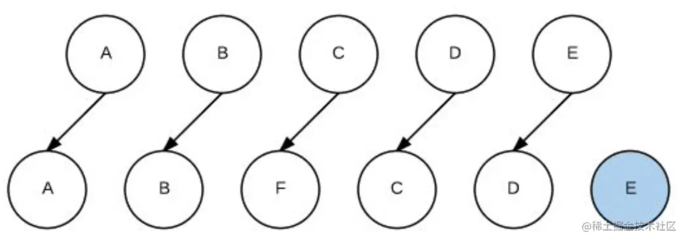

### 说一说 SPA 与 MPA 的区别及其 SEO 优化方案
- 前后端分离基本概念：前后端根据 AJAX 接口进行数据的交互，前端根据后端服务器返回的数据进行页面渲染

- SPA，前端则一般使用SPA来进行页面开发。SPA单页面应用，它通过监听 url 变化，动态重写当前页面与用户交互，这种方法避免了页面之间切换时需要请求 html 的额外开销

- 优点：应用内页面间切换速度快、实现良好的前后端分离，分工更明确

- 缺点：首屏渲染速度很慢、不利于 SEO（搜索引擎优化）

- MPA多页面应用，每个页面都是一个主页面，都是独立的。当我们在切换访问另一个页面的时候，都需要重新向服务器请求

- SPA 的 SEO 优化方案通过使用 SSR 服务端渲染来解决

- https://github.com/jtwang7/React-Note/issues/36


### 说一说你对 SSR 和 CSR 的理解
- 一个 SPA 应用默认的渲染方案是 CSR 客户端渲染
```
客户端：在浏览器地址中输入 url

客户端：浏览器向服务端请求页面资源 -> 服务端：接受请求，并返回(空的)HTML页面。此处空页面指的是 SPA 应用中页面的 root 节点，实际页面还包含了 js 代码。

客户端：接收得到的 HTML 页面，并渲染。(此时展示空白页面，因为还没有动态生成内容)
客户端：解析 HTML 页面，读取到 script 标签后，再次向服务端发送请求。 -> 服务端：接受请求，返回 js 文件。
客户端：执行 js 代码，渲染页面。
客户端：可能会在渲染过程中，再次发送 ajax 请求，获取页面初始化需要的数据。 -> 服务端：接受请求，返回数据
客户端：获取数据，再次渲染页面
```

- SSR 服务端渲染是指将SPA应用在服务器端渲染成 HTML 片段，发送到浏览器，然后交由浏览器为其绑定状态与事件，成为完全可交互页面的过程
```
服务端渲染涉及到了 Node 中间层，因此需要一些能在 Node.js 上运行的框架支撑

客户端：在浏览器地址中输入 url
客户端：浏览器向服务端请求页面资源

Node 中间层：注意，此时请求会被 Node 服务器获取，Node 服务器接收到请求后，通过当前 url 路由分析，找到匹配的路由组件，然后判断当前路由组件中是否需要请求数据，若需要则会向业务接口服务器请求数据资源，然后在 Node 服务器中完成初步的页面渲染，返回 HTML (此时已在 Node 服务端完成了初步的 DOM 搭建，root 节点中是有内容的)

客户端：浏览器接收 HTML 页面，并渲染。(会渲染得到服务端已经初步搭建好的 DOM 树)
客户端：解析 HTML 页面，遇到 script 标签时，再次向服务器发送请求 -> Node 服务器：接受请求并返回对应的js文件
客户端：执行 js 代码，渲染页面 (此时 js 主要处理一些事件绑定的逻辑)
```

- 更快的首屏加载速度：无需等待 JavaScript 完成下载且执行才显示内容

- 更友好的 SEO：爬虫可以直接抓取渲染之后的页面

- https://github.com/jtwang7/React-Note/issues/36


### Vue中的 v-show 和 v-if 怎么理解？
- 控制手段：
v-show隐藏则是为该元素添加display:none，dom元素依旧还在。v-if显示隐藏是将dom元素整个添加或删除

- 编译过程：
v-if切换有一个局部编译/卸载的过程，切换过程中合适地销毁和重建内部的事件监听和子组件；v-show只是基于css切换

- 编译条件：
v-if是真正的条件渲染，它会确保在切换过程中条件块内的事件监听器和子组件适当地被销毁和重建。渲染条件为假时，并不做操作，直到为真才渲染

- v-show 由false变为true的时候不会触发组件的生命周期

- v-if由false变为true的时候，触发组件的创建周期的钩子，由true变为false的时候触发组件的销毁周期

- 性能消耗：v-if有更高的切换消耗；v-show有更高的初始渲染消耗；

- https://github.com/febobo/web-interview/issues/4


### 说说你对 keep-alive 的理解是什么？
- keep-alive是vue中的内置组件，能在组件切换过程中将状态保留在内存中，防止重复渲染DOM

- keep-alive 包裹动态组件时，会缓存不活动的组件实例，而不是销毁它们

- 结合属性include和exclude可以明确指定缓存哪些组件或排除缓存指定组件，添加两个生命周期钩子

- keep-alive 包裹路由组件时，vue2 和 vue3 有区别

- 缓存后如果要获取数据，解决方案可以有以下两种：beforeRouteEnter、actived

- https://juejin.cn/post/7097067108663558151#heading-85
- https://github.com/febobo/web-interview/issues/19


### Vue 中的 $nextTick 有什么作用？
- Vue 在更新 DOM 时是异步执行的
```
数据在发现变化的时候，vue并不会立刻去更新Dom，而是将修改数据的操作放在了一个异步操作队列中,如果我们一直修改相同数据，异步操作队列还会进行去重
```

- 如果想要在修改数据后得到更新后的DOM结构，可以使用Vue.nextTick()
```
在Vue内部，nextTick之所以能够让我们看到DOM更新后的结果，是因为我们传入的callback会被添加到队列刷新函数(flushSchedulerQueue)的后面，这样等队列内部的更新函数都执行完毕，所有DOM操作也就结束了，callback自然能够获取到最新的DOM结构
```


### 你知道 Vue 中 key 的作用吗？说说你对它的理解？
- key是给每一个vnode的唯一id，也是diff的一种优化策略，可以根据key，更准确，更快的找到对应的vnode节点
```
vue在patch过程中,通过 sameVnode 函数判断两个节点是否相同，主要判断两者的key和元素类型等

因此如果不设置key，它的值就是undefined，则可能导致两个并不是相同的节点，被认为是相同节点，只能去做更新操作。以此类推，这造成了大量的dom更新操作，使得整个patch过程比较低效，影响性能
```

- 所以合理利用key可以有效减少真实Dom的变动，从而减少页面重绘和回流的频率，进而提高页面更新的效率

- 使用场景一：使用v-for渲染列表时，需要给每个单元加上key，尽量不用数组下标而用独有的id属性

- 使用场景二：用+new Date()生成的时间戳作为一个组件的key，可手动强制触发重新渲染

- https://www.bilibili.com/video/BV1m7411P7oD/?spm_id_from=333.337
- https://juejin.cn/post/7097067108663558151#heading-65


### 为什么 data 属性是一个函数而不是一个对象？
- 根实例对象data可以是对象也可以是函数（根实例是单例），不会产生数据污染情况

- 组件实例对象data必须为函数，目的是为了防止多个组件实例对象之间共用一个data，产生数据污染。采用函数的形式，在执行 initData 时会将其作为工厂函数返回全新 data 对象，有效规避多实例之间状态污染问题

- https://github.com/febobo/web-interview/issues/9


### Vue3.0 里为什么要用 Proxy 替代 defineProperty ？
- defineProperty：利用get、set这两个trap实现拦截
```
Vue2中使用defineProperty的原因是，早期只能用这种方式。由于该API存在一些局限性，比如对于数组的拦截有问题，为此vue需要专门为数组响应式做一套实现。另外不能拦截那些新增、删除属性；最后defineProperty方案在初始化时需要深度递归遍历待处理的对象才能对它进行完全拦截，明显增加了初始化的时间
```

- Proxy：利用get、set、deleteProperty这三个trap实现拦截
```
以上的问题在Proxy出现之后迎刃而解，不仅可以对数组实现拦截，还能对Map、Set实现拦截；另外Proxy的拦截也是懒处理行为，如果用户没有访问嵌套对象，那么也不会实施拦截，这就让初始化的速度和内存占用都改善了
```

- https://juejin.cn/post/7115055320913117220#heading-119


### 路由下的 History 模式和 Hash 模式有何区别？
- hash模式在地址栏显示的时候是已哈希的形式：#/xxx，这种方式使用和部署简单，但是不会被搜索引擎处理，seo有问题

- history模式url是美观的，但是它要求应用在部署时做特殊配置，服务器需要做回退处理，否则会出现刷新页面404的问题

- https://router.vuejs.org/zh/guide/essentials/history-mode.html


### 简单说一说你对 vuex 理解？
- Vuex 是一个专为 Vue.js 应用开发的状态管理模式 + 库，它采用集中式存储，管理应用的所有组件的状态

- state、mutation、action、getter 介绍一下

- 讲一下项目中使用 vuex 的记录：vue3项目中的 [Vuex 获取动态数据流程] 这一节


### 参考图片
